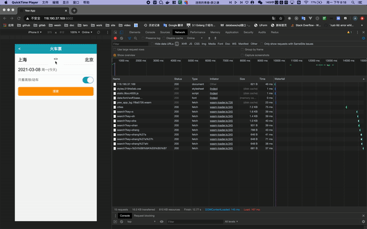

# yew-train-ticket

A Rust WebAssembly Websit example to buy train ticket using yew hooks.

## Snapshot

You can visit in the website online [yew-train-ticket](http://118.190.37.169:8002)



## Code example

- Define Store and Action

``` rust
#[derive(Clone, Debug, PartialEq)]
pub struct StoreModel {
    pub from: String,
    pub to: String,
    pub local_time: DateTime<Local>,
    pub is_high_speed: bool,
    pub date_selector_visible: bool,
    pub city_selector_visible: bool,
    pub is_selecting_from: bool,
}

pub enum Action {
    ExchangeFromTo,
    ToggleHighSpeed,
    ToggleDateSelectorVisible,
    ToggleCitySelectorVisible,
    SelectDate(DateTime<Local>),
    SelectFrom(String),
    SelectTo(String),
    SetIsSelectingFrom(bool),
}
```


- A simple Function Component using use_context hooks

``` rust
#[derive(Properties, Clone, PartialEq)]
pub struct Props {
    pub onexchange: Callback<MouseEvent>,
    pub onclickto: Callback<MouseEvent>,
    pub onclickfrom: Callback<MouseEvent>,
}

#[function_component(Journey)]
pub fn journey(props: &Props) -> Html {
    let ctx = use_context::<Rc<StoreModel>>().expect("no ctx found");
    let StoreModel { to, from, .. } = &**ctx;

    let Props { onexchange, onclickto, onclickfrom } = &props;
    return html! {
        <div class="journey">
            <div
                class="journey-station"
                onclick=onclickfrom
            >
                <input
                    type="text"
                    readOnly =true
                    name="from"
                    value={from}
                    class="journey-input journey-from"
                />
            </div>
            <div class="journey-switch"
             onclick=onexchange
            >
                {"<>"}
            </div>
            <div
                class="journey-station"
                onclick=onclickto
            >
                <input
                    type="text"
                    readOnly=true
                    name="to"
                    value={to}
                    class="journey-input journey-to"
                />
            </div>
        </div>
    };
}

```

> use_state, use_effect_with_deps, use_reducer_with_init hooks is used in other code.


- Fetch and Deserialize

``` rust
#[derive(Debug, Serialize, Deserialize)]
pub struct SearchCityResult {
    pub result: Vec<SearchResult>,
    pub searchKey: String,
}

impl SearchCityResult {
    pub fn new() -> SearchCityResult {
        SearchCityResult {
            result: vec![],
            searchKey: "".to_string(),
        }
    }
}

#[derive(Debug, Serialize, Deserialize)]
pub struct SearchResult {
    pub key: String,
    pub display: String,
}

pub async fn search_city_list(search_word: String) -> SearchCityResult {
    let base_url = "http://118.190.37.169:7000";
    let url = format!("{}/api/search?key={}", base_url, search_word);
    let json = Fetch::get(url).await;

    match json {
        Ok(json) => json.into_serde().unwrap(),
        Err(_) => SearchCityResult::new(),
    }
}
```
## Backend

The websit backend is powered by actix-web. [actix-train-ticket](https://github.com/anthhub/actix-train-ticket)

### web api
- http://118.190.37.169:7000/api/cities   -- list cities of China
- http://118.190.37.169:7000/api/search?key=上海  -- list cities of China

## How to use it

```sh
npm install
```

### develop

```sh
# Builds the project and opens it in a new browser tab. Auto-reloads when the project changes.
npm start
```

### release

```sh
# Builds the project and places it into the `dist` folder.
npm run build
```